# (Pixel Art) Punk Sandbox

How-tos and samples scripts to generate your own punk pixel art and more

## Scripts - What's News?

### Backgrounds

Free punk background patterns, flags & more incl.
 midnight ,
 purple ,
 swamp ,
 matrix 1/2/3 
  
  ,
 rainbow 1/2/3/4 
  
  
  ,
 save ukraine ,
 & more

Example - Left-looking Marylin P(h)unkette (in 4x)

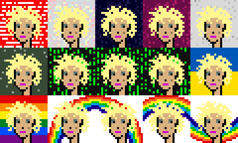

For more see [**/backgrounds »**](backgrounds)

### Punks XL

Upsize "classic" 24px punks to XL using "matching" cyberpunks attributes in 32px.

Example 1 - Female 1/2/3, Male 1/2/3 and The First Six Punks Side-By-Side

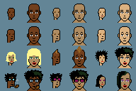

Example 1b - The First Six Punks w/ Codelines "Matrix" Background

Example 2 - Super-Rare Top Selling Zombies Side-By-Side Incl. New Never-Before-Seen Zombies w/ Messy Bun, Long Green Front Braid, Divine Robe  & More

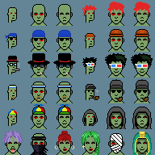

Example 3 - Super-Rare Top Selling Apes Side-By-Side Incl. New Never-Before-Seen White, Black, Gorilla, Pink, Golden & More Ape Archetypes

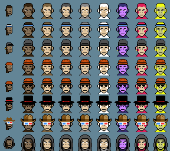

Example 4 - Super-Rare Top Selling Million Dollar Aliens Side-By-Side

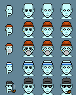

Example 4b - Aliens w/ Metropolis Background Plus - Bonus - Two New Super-Rare  Never-Before-Seen Alien Punks

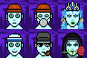

For more see [**/cyberpunks-classic »**](cyberpunks-classic)

###  "Auto-Magically" Generate Low-Effort Punks Using (Hiqh-Quality) Pixel Scaling Algorithms - Low Effort Punks, The "High Quality 4X (HQ4X) @ 96x96PX" Edition - Yes, You Can!

Example - 4x Pixel Scaling Algorithms (from 24px to 96px) - Case Study - The First Six Punks Side-By-Side - 4x vs HQ4x vs Original "Low-Effort Hand-Drawn in 60-Seconds" - Spot the Difference

 =>  vs  vs 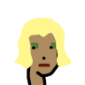   
 =>  vs  vs   
 =>  vs  vs   
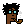 => 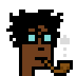 vs 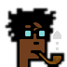 vs   
 => 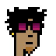 vs  vs   
 => 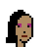 vs  vs 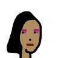  

For more see [**/loweffort »**](loweffort)

### 25px Originals Presents: Black Eyed Peas - The Beginning (Anno 2010) Remastered - The Punk (Pixel) Edition (Anno 2022)

Four punk (pixel) characters / heads, that is,
 will.i.am,
 fergie,
 taboo &
 apl.de.ap from
the album cover artwork [**The Beginning (Anno 2010)**](https://en.wikipedia.org/wiki/The_Beginning_%28Black_Eyed_Peas_album%29) of the sixth studio album by American group Black Eyed Peas
remastered in the 25x25px format.

Example - The Beginning, The Punk Edition (Anno 2022) in 4x - Spot The Difference From the Album Artwork (Anno 2010)

For more see [**/blackeyedpeas »**](blackeyedpeas)

### 24px Originals Presents: Weird and Not Weird (Pixel) Whales - The Punk Edition Starter Kit (Incl. Beanie, Top Hat, Headband, Cap & More)

Remember  the story of the 12-year-old British teenager - [**Benyamin Ahmed aka Obi Wan Benoni**](https://github.com/Weird-Whales/images) -  pulling in a $300 000+ fortune in minutes with faux-pixel punk art - that is, 3350 weird whales [with the help of google - [**for the whale pixel art**](http://pixelartmaker.com/art/43a873c00a73712) - and his programming pro father and [**a South African (crypto) pro coder**](https://etherscan.io/address/0x96ed81c7f4406eff359e27bff6325dc3c9e042bd#code) from [**Boring Bananas Company (BBCo)**](https://www.boringbananas.co)]?

To get you started with your own weird or not weird (pixel) whales for easy (re)use the
 whale pixel art in a 24x24 canvas / format

Example 1 -  Four Weird And Not Weird Whales (in 2x)

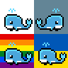

Example 2 -  Four Weird And Not Weird Whales (in 2x) with "Faux-Pixel" Headwear (in 1x)

For more see [**/whales »**](whales)

### 32px Originals Presents: Lucky (Pixel) Cats

Example 1 - Collect'em All! - Lucky (Pixel) Cats in All Nine Colors - Black, Purple, Blue, Green, Red, Pink, Orange, Yellow, White

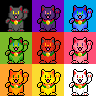

For more see [**/luckycats »**](luckycats)

### AAAAAAAUUUUUGGGHHHHH! 32px Originals Presents: Doge (Much Wow) Shiba Inus X (Ugly) Goblins - The Next Million $$$ Modern Art Collection?

Example 1 -  Four Doge (Much Wow) Shiba Inus X (Ugly) Goblins

For more see [**/doge_x_goblins »**](doge_x_goblins)

### 24px Originals Presents:  (Sweet & Sour) Candy Bears - The Next Million $$$ Modern Art Collection?

Example 1 - Four (Sweet & Sour) Candy (Pixel) Bears

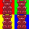

Example 2 - Pick Your Own Colors (Hues) For the (Sweet & Sour) Candy (Pixel) Bears e.g. Raspberry, Lemon, Strawberry, Pineapple, Orange & More

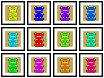

Example 3 - Pop Art Tableau w/ Eight Rainbow Colored (Sweet & Sour) Candy Bears In A Three X Eight Line-up

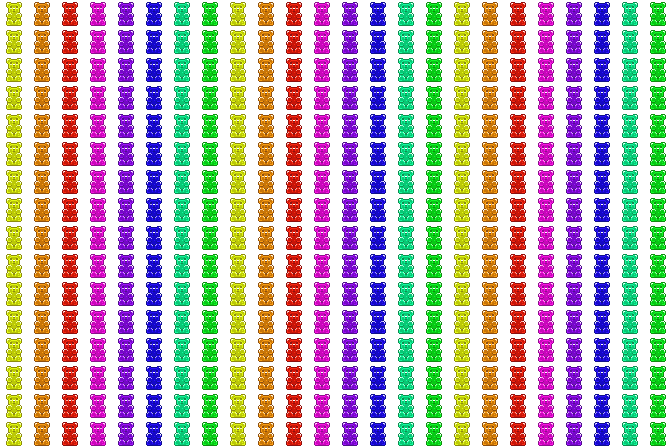

For more see [**/candybears »**](candybears)

### 24px Originals Presents: Tulip Mania - Tulips, Tulips, Tulips In The Classic 24x24 Format

Example 1 - Thirty Tulips in Classic Black Modern Frames

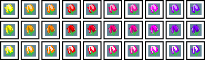

For more see [**/tulips »**](tulips)

## License

The `punks.sandbox` scripts are dedicated to the public domain.
Use it as you please with no restrictions whatsoever.

## Questions? Comments?

Post them on the [D.I.Y. Punk (Pixel) Art reddit](https://old.reddit.com/r/DIYPunkArt). Thanks.

