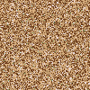
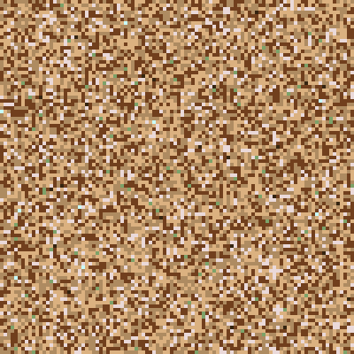

# Color Experiments

## One Pixel Skin Tone (Distribution) Composites

All 10 000 punks in the classic 100 by 100 grid with 1 pixel per punk (and skintone).
Visual for punk distribution.

Example 1 - All 10 000 Skin Tones

4x 
8x 

Example 2 - Rarities Only (9 Alien, 24 Ape, 88 Zombie Only)

4x 

That's it for now.

## Questions? Comments?

Post them on the [CryptoPunksDev reddit](https://old.reddit.com/r/CryptoPunksDev). Thanks.

