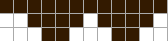
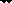
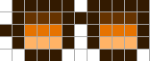

# Cool Punks Experiment - Draw Your Own Sun Glasses (from Scratch)

Mint Yourself Free Punks with Sun Glasses


Here's the experiment - let's draw some sun glasses (from scratch / from zero)
and let's turn zero-attribute "plain vanilla" punk archetypes
into cool punks with shades.


Let's use the online punk pixel drawing tool (see => [**cryptopunksnotdead.github.io**](https://cryptopunksnotdead.github.io) )
to draw all-black sun glasses in 12x3 size.




Tip: Use the print button to export the sun glasses into
a ready-to-cut-n-paste pixel matrix.


Let's try:

``` ruby
shades1 = Image.parse( <<TXT, colors: ['000000'] )
1 1 1 1 1 1 1 1 1 1 1 1
0 0 1 1 1 1 0 1 1 1 1 0
0 0 0 1 1 0 0 0 1 1 0 0
TXT

shades1.save( './shades1.png' )
shades1.zoom(4).save( './shades1x4.png' )
```

Resulting in:




Let's add the shades to the four archetypes
(human, zombie, ape, alien)  with the human in the four
variants (lighter, light, dark, darker)
and let's add four more archetypes
(demon, vampire, orc, skeleton) for fun.


``` ruby
designs = [
  'human-male!lighter',
  'human-male!light',
  'human-male!dark',
  'human-male!darker',
  'zombie-male',
  'ape-male',
  'alien-male',
  'demon-male',
  'vampire-male',
  'orc-male',
  'skeleton-male',
]


designs.each do |design|
  punk = Punks::Image.new( design: design )

  x, y = [6, 11]                 ## head offset
  punk.compose!( shades1, x, y )

  name = design.sub( '!', '_')   ## note: change human-male!lighter to human-male_lighter

  punk.save( "./i/coolpunk-#{name}_1.png" )
  punk.zoom(4).save( "./i/coolpunk-#{name}_1x4.png" )
end
```


Resulting in:


Let's draw and try another sunglasses design:



``` ruby
shades2 = Image.parse( <<TXT, colors: ['000000', '690C45', '8C0D5B', 'AD2160'] )
0 1 1 1 1 1 0 1 1 1 1 1
0 1 2 2 2 1 1 1 2 2 2 1
1 1 3 3 3 1 0 1 3 3 3 1
0 1 4 4 4 1 0 1 4 4 4 1
0 0 1 1 1 0 0 0 1 1 1 0
TXT

shades2.save( './shades2.png' )
shades2.zoom(4).save( './shades2x4.png' )
```

Resulting in:


And


And let's draw and try another sunglasses design:


``` ruby
shades3 = Image.parse( <<TXT, colors: ['000000', '000766', '0010e6'] )
1 1 1 1 1 1 1 1 1 1 1 1
0 0 1 2 2 1 0 1 2 2 1 0
0 0 1 3 3 1 0 1 3 3 1 0
0 0 0 1 1 0 0 0 1 1 0 0
TXT

shades3.save( './shades3.png' )
shades3.zoom(4).save( './shades3x4.png' )
```

Resulting in:


And


That's it for now.  Now design your own sunglasses. Yes, you can!


## Questions? Comments?

Post them on the [CryptoPunksDev reddit](https://old.reddit.com/r/CryptoPunksDev). Thanks.
