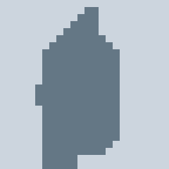
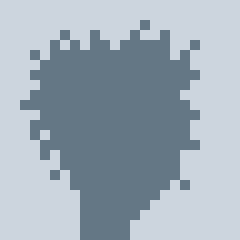
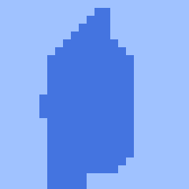
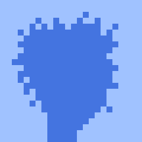
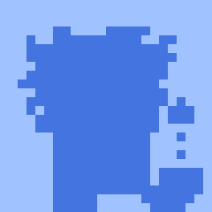
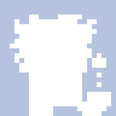

# Do-It-Yourself (DIY) - Yes, You Can - Generate Your Own Default Profile Pictures (PFPs)


The idea -  turn punk pixel heads into default profile pic(ture)s via [**Image#silhouette**](https://github.com/learnpixelart). (Credit to [@piv_piv](https://twitter.com/piv_piv/status/1577641420881543175) and [@dumbnamenumbers](https://twitter.com/dumbnamenumbers/status/1582500383355654145).)






Let's try the first Matt & John's® pixel punk heads
(re)generated from scratch (via text-to-image attributes)
turned into default profile pic(ture)s
with the foreground color in red/green/blue (rgb) hex `0x647785`
and the background color `0xCCD5DE`.


``` ruby
require 'punks'

specs = parse_data( <<TXT )
  Female 2, Earring, Blonde Bob, Green Eye Shadow
  Male 1, Smile, Mohawk
  Female 3, Wild Hair
  Male 1, Wild Hair, Pipe, Nerd Glasses
  Male 2, Goat, Earring, Wild Hair, Big Shades
  Female 2, Earring, Half Shaved, Purple Eye Shadow
  Male 2, Do-rag
  Female 2, Spots, Wild White Hair, Clown Eyes Blue
  Male 1, Luxurious Beard, Messy Hair
  Male 2, Big Beard, Police Cap, Clown Nose
  Female 1, Mohawk, Blue Eye Shadow
  Female 2, Black Lipstick, Straight Hair Dark, Clown Eyes Green
  Female 1, Purple Lipstick, Blonde Short
  # ...
TXT

specs.each_with_index do |attributes,i|
  img = YeOldePunk::Image.generate( *attributes )

  profilepic = img.silhouette( '0x647785' ).background( '0xCCD5DE' )
  profilepic.save( "punk#{i}.png" )
  profilepic.zoom(10).save( "punk#{i}@10x.png" )
end
```


Resulting in:


## Is Blue The New Gray?  Yes, You Can - Try More Colors







With the new foreground color in red/green/blue (rgb) hex `0x4474E0`
and the background color `0xA0C2FF`. Re-run the script
resulting:


---





Or with the new foreground color in red/green/blue (rgb) hex `0xFFFFFF` (also known as white)
and the background color `0xB5C3DE`. Re-run the script
resulting:


## Bonus: Is Circle The New Square?  Yes, You Can - Try More Shapes


Tip:  Use [**Image#circle**](https://github.com/learnpixelart) to turn the square image (e.g. 240×240) into a circle (that is, pixels outside the inner circle get changed to transparent in the square image).


## Questions? Comments?

Post them on the [D.I.Y. Punk (Pixel) Art reddit](https://old.reddit.com/r/DIYPunkArt). Thanks.
