# "Faceless" and Universal/Unisize/Unisex Archetypes

Punk #0

 ->
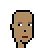 ->
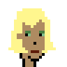

Punk #1

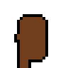 ->
 ->
   <=>
@4x.png)

Try female-style with faceless "round" style and nose "small"
and mouth with "standard" red-ish color

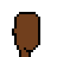 ->
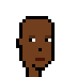 ->
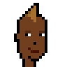  <=>
@4x.png)

Punk #2

 ->
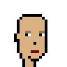 ->
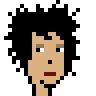  <=>
@4x.png)

Try male-style

 ->
 ->
 <=>
@4x.png)

Punk #3

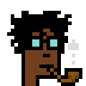  <=>
@4x.png)

Try female-style with faceless "round" style and nose "small"
and mouth with "standard" red-ish color

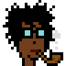 <=>
@4x.png)

Punk #4

 <=>
@4x.png)

Try female-style with faceless "round" style and nose "small"
and mouth with "standard" red-ish color

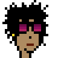 <=>
@4x.png)

## Questions? Comments?

Post them on the [CryptoPunksDev reddit](https://old.reddit.com/r/CryptoPunksDev). Thanks.
