# Frame Your Punks (24x24px) - Free Golden Pixel Art Frame (36x36px) & More

Let's try the frameless punks (24x24px)
\#2890 ,
\#8219 ,
\#10180 ,
\#10190 .

Let's try the free golden pixel art frame (36x36).

4x   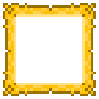

Here we go:

4x  

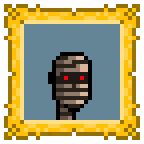

8x  
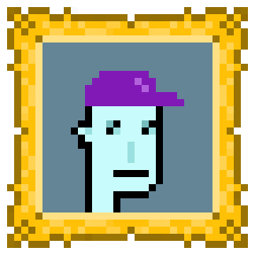
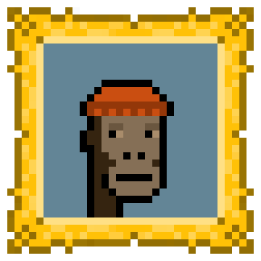

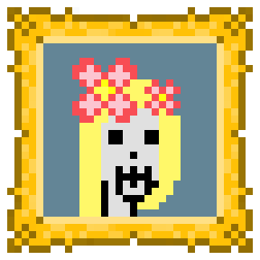

## "Oil Painting" Punks by Leonardo da Vinci, Johannes Vermeer van Delft, Vincent van Gogh, Edvard Munch

Let's try the frameless "oil painting" punks

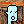

Here we go:

4x  

8x  

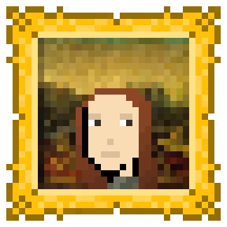

## Bonus - Classic Modern Black Frame

Let's try the free classic modern black pixel art frame (38x38).

4x   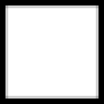

Here we go:

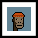
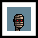

4x  
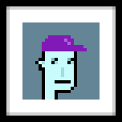

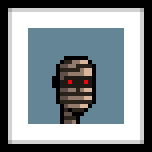

8x  

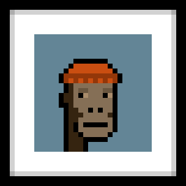

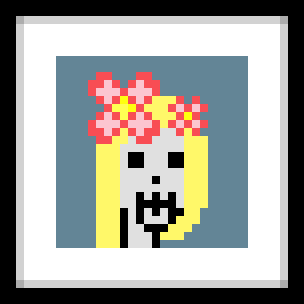

That's it for now.

## Questions? Comments?

Post them on the [CryptoPunksDev reddit](https://old.reddit.com/r/CryptoPunksDev). Thanks.

