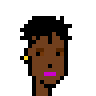
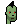
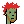

_"Pixel Perfect" Pixel Punk Public Domain "Clean-Room" Generation from Scratch / Zero_

# Free (Pixel) Punks - Famous Top Exclusive Legendary Premium Art Collections - Right-Click and Save to Own 100% Forever

Art Collections

- [Wired (Magazine) December 2021/January 2022](#wired-magazine-december-2021january-2022)
- [Christie's Auction (21st Century Evening Sale) May 2021](christies-auction-21st-century-evening-sale-may-2021)
- [Top Sales](#top-sale)

## What is the "right-clicker mentality"!?

> Quite literally, it is referring to one's ability to right-click
> on any image you see online to bring up a menu
> and select the "save" option in order to save a copy of the image
> to your device. In this term we have a microcosm of
> the entire philosophical debate surrounding non-fungible [art] tokens.
>  Non-fungible [art] tokens, are unique tokens on the blockchain ostensibly
> representing a receipt of ownership pointing to some (usually) digital thing,
> like a JPEG hosted on a server somewhere.
> To be an non-fungible [art] token collector is to philosophically buy
> into the idea that owning this string of numbers means you "own" a JPEG
> that lesser people simply right-click to save on their own machines
> at any time [for free].
>
> [...]
>
> This entire idea of owning an infinitely-copyable
> bundle of pixels because it says so on a digital list called a blockchain
> is a profit-seeking farce.
> Right-clicking a JPEG, saving it, and displaying it back
> to the non-fungible [art] token owner a way to point out the Emperor has no clothes.
>
> (Source:  [What the Hell is Right-Clicker (and Save) Mentality!?](https://www.vice.com/en/article/5dgzed/what-the-hell-is-right-clicker-mentality), Vice)

## Wired (Magazine) December 2021/January 2022

> The Cryptopunks:
>
> 1. Punk 5124: She is one of 147 Punks who have a blond bob and
>    one of 332 wearing a VR headset.
> 2. Punk 5224: His luxurious beard can be found on 286 Punks,
>    while 414 have finger-in-socket red hair.
>    This Punk sold in April for $66,664.
> 3. Punk 1478: One of 88 zombies, this bearded, wild-haired Punk
>    is Erick Calderon's avatar on Discord and Twitter.
> 4. Punk 4344: She is one of 382 with green clown-eye makeup;
>    696 have red lipstick. Her creators call her coif "frumpy hair".
> 5. Punk 3435: She rocks a sporty headband (406) and has purple lips (655).
>    Serena Williams owns a nearly identical Punk.
> 6. Punk 7804: Only nine aliens exist.
>    The cofounder of the startup Figma, Dylan Field, sold this one
>    in March for $7.57 million.
> 7. Punk 1629: Claire Silver's avatar is set apart by her black lipstick (617)
>    and the rare "pink with hat" trait (95).
> 8. Punk 5724: This woman is one of 461 Punks with an eye patch
>    and one of 447 with wild hair.
>
> (Source: [The 10,000 Faces That Launched an NFT Revolution](https://www.wired.com/story/the-10000-faces-that-launched-an-nft-revolution/), Wired)

Original 24x24px Format

4x

(Image Credits: [Free (Pixel) Punks Generate Script](generate.rb) - Courtesy of Crypto Punk's Not Dead)

## Christie's Auction (21st Century Evening Sale) May 2021

> For the first time, 5,184 pixels' worth of a revolutionary
> non-fungible [art] token project will go up for auction
> at a traditional auction house, courtesy of the project
> creators and pioneers themselves.
>
> [...]
>
> Larva Labs (2005), CryptoPunks, 2017. Non-fungible token (jpg).
> 24 x 24 pixels each, 9 'CryptoPunks' total.
> Estimate: $7,000,000-9,000,0000.
> Offered in 21st Century Evening Sale on 11 May at Christie's in New York
>
> (Source: [10 Things to Know About CryptoPunks]( https://www.christies.com/features/10-things-to-know-about-CryptoPunks-11569-1.aspx), Christie's)

Original 24x24px Format

4x

(Image Credits: [Free (Pixel) Punks Generate Script](generate.rb) - Courtesy of Crypto Punk's Not Dead)

## Top Sales

> 1.  Punk #3100  - 4.2KΞ ($7.58M) - March 11st, 2021
> 2.  Punk #7804 - 4.2KΞ ($7.57M) - March 11st, 2021
> 3.  Punk #5217  - 2.25KΞ ($5.45M) - July 30th, 2021
> 4.  Punk #8857 - 2KΞ ($6.63M) - September 11st, 2021
> 5.  Punk #7252 - 1.6KΞ ($5.33M) - August 24th, 2021
> 6.  Punk #2140 - 1.6KΞ ($3.76M) - July 30th, 2021
> 7.  Punk #2338  - 1.5KΞ ($4.32M) - August 6th, 2021
> 8.  Punk #6275  - 1.32KΞ ($5.12M) - September 4th, 2021
> 9.  Punk #7252  -  1KΞ ($2.53M)  - August 4th, 2021
>
> (Source:  [CryptoPunks Top Sales](https://www.larvalabs.com/cryptopunks/topsales))

Original 24x24px Format

4x

(Image Credits: [Free (Pixel) Punks Generate Script](generate.rb) - Courtesy of Crypto Punk's Not Dead)

## Questions? Comments?

Post them on the [CryptoPunksDev reddit](https://old.reddit.com/r/CryptoPunksDev). Thanks.

