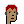
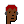
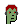
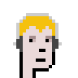
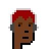
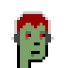
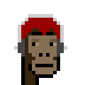
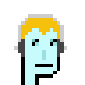

# Headphone -  Attribute of the Day  -  Punk w/ Headphone


Let's get inspired by
[Bit Punk! #062 on Cardano](https://bitpunkcardano.com/bit/062/)
and let's design headphones from scratch:


``` ruby
headphone = Image.parse( <<TXT, colors: ['444444', 'CDCDCD'] )
. . . . x x x x x x x . . . .
. . . x . . . . . . . x . . .
. . x . . . . . . . . . x . .
. x . . . . . . . . . . . x .
. x . . . . . . . . . . . x .
. x . . . . . . . . . . . x .
. x . . . . . . . . . . . x .
. x @ . . . . . . . . . @ x .
. @ @ . . . . . . . . . @ @ .
x @ @ . . . . . . . . . @ @ x
. @ @ . . . . . . . . . @ @ .
. . @ . . . . . . . . . @ . .
TXT

headphone.save( 'headphone.png' )
headphone.zoom(4).save( 'headphone4x.png' )
```

Voila!

 4x 


And let's try the headphone 
on the punk archetypes


:


``` ruby
designs = [
  'human-male!lighter',
  'human-male!light',
  'human-male!dark',
  'human-male!darker',
  'zombie-male',
  'ape-male',
  'alien-male',
 ]

designs.each do |design|
  punk = Punks::Image.new( design: design )

  punk[4,12] = 0   if design == 'alien-male'   ## quick hack/fix for alien ear

  punk.compose!( headphone, 4, 4 )

  name = design.sub( '!', '_')   ## note: change human-male!lighter to human-male_lighter

  punk.save( "punk_headphone-#{name}.png" )
  punk.zoom(4).save( "punk_headphone-#{name}x4.png" )
end
```


Voila!


4x


Let's add hair .
Voila!







4x









That's it.  Now design and try your own attributes.
Yes, you can!


## Questions? Comments?

Post them on the [CryptoPunksDev reddit](https://old.reddit.com/r/CryptoPunksDev). Thanks.


