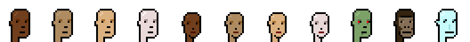

# Inside the CryptoPunksData Contract - All 133 Assets (11 Archetypes 'n' 122 Attributes) in the 24x24px Format For Easy (Re)Use "Off-Chain"

How does it work? See [**Inside the CryptoPunksData Contract - Decoding the On-Chain Assets 'n' Color Palette »**](../punksdata)

| 24x24     | No   | Name |
|-----------|------|------|
|  |  1 | Male 1 |
|  |  2 | Male 2 |
|  |  3 | Male 3 |
|  |  4 | Male 4 |
|  |  5 | Female 1 |
|  |  6 | Female 2 |
|  |  7 | Female 3 |
|  |  8 | Female 4 |
|  |  9 | Zombie |
|  |  10 | Ape |
|  |  11 | Alien |
|  |  12 | Rosy Cheeks |
|  |  13 | Luxurious Beard |
|  |  14 | Clown Hair Green |
|  |  15 | Mohawk Dark |
|  |  16 | Cowboy Hat |
|  |  17 | Mustache |
|  |  18 | Clown Nose |
|  |  19 | Cigarette |
|  |  20 | Nerd Glasses |
|  |  21 | Regular Shades |
|  |  22 | Knitted Cap |
|  |  23 | Shadow Beard |
|  |  24 | Frown |
|  |  25 | Cap Forward |
|  |  26 | Goat |
|  |  27 | Mole |
|  |  28 | Purple Hair |
|  |  29 | Small Shades |
|  |  30 | Shaved Head |
|  |  31 | Classic Shades |
|  |  32 | Vape |
|  |  33 | Silver Chain |
|  |  34 | Smile |
|  |  35 | Big Shades |
|  |  36 | Mohawk Thin |
|  |  37 | Beanie |
|  |  38 | Cap |
|  |  39 | Clown Eyes Green |
|  |  40 | Normal Beard Black |
|  |  41 | Medical Mask |
|  |  42 | Normal Beard |
|  |  43 | VR |
|  |  44 | Eye Patch |
|  |  45 | Wild Hair |
|  |  46 | Top Hat |
|  |  47 | Bandana |
|  |  48 | Handlebars |
|  |  49 | Frumpy Hair |
|  |  50 | Crazy Hair |
|  |  51 | Police Cap |
|  |  52 | Buck Teeth |
|  |  53 | Do-rag |
|  |  54 | Front Beard |
|  |  55 | Spots |
|  |  56 | Big Beard |
|  |  57 | Vampire Hair |
|  |  58 | Peak Spike |
|  |  59 | Chinstrap |
|  |  60 | Fedora |
|  |  61 | Earring |
|  |  62 | Horned Rim Glasses |
|  |  63 | Headband |
|  |  64 | Pipe |
|  |  65 | Messy Hair |
|  |  66 | Front Beard Dark |
|  |  67 | Hoodie |
|  |  68 | Gold Chain |
|  |  69 | Muttonchops |
|  |  70 | Stringy Hair |
|  |  71 | Eye Mask |
|  |  72 | 3D Glasses |
|  |  73 | Clown Eyes Blue |
|  |  74 | Mohawk |
|  |  75 | Pilot Helmet |
|  |  76 | Tassle Hat |
|  |  77 | Hot Lipstick |
|  |  78 | Blue Eye Shadow |
|  |  79 | Straight Hair Dark |
|  |  80 | Choker |
|  |  81 | Crazy Hair |
|  |  82 | Regular Shades |
|  |  83 | Wild Blonde |
|  |  84 | 3D Glasses |
|  |  85 | Mole |
|  |  86 | Wild White Hair |
|  |  87 | Spots |
|  |  88 | Frumpy Hair |
|  |  89 | Nerd Glasses |
|  |  90 | Tiara |
|  |  91 | Orange Side |
|  |  92 | Red Mohawk |
|  |  93 | Messy Hair |
|  |  94 | Clown Eyes Blue |
|  |  95 | Pipe |
|  |  96 | Wild Hair |
|  |  97 | Purple Eye Shadow |
|  |  98 | Stringy Hair |
|  |  99 | Dark Hair |
|  |  100 | Eye Patch |
|  |  101 | Blonde Short |
|  |  102 | Classic Shades |
|  |  103 | Eye Mask |
|  |  104 | Clown Hair Green |
|  |  105 | Cap |
|  |  106 | Medical Mask |
|  |  107 | Bandana |
|  |  108 | Purple Lipstick |
|  |  109 | Clown Nose |
|  |  110 | Headband |
|  |  111 | Pigtails |
|  |  112 | Straight Hair Blonde |
|  |  113 | Knitted Cap |
|  |  114 | Clown Eyes Green |
|  |  115 | Cigarette |
|  |  116 | Welding Goggles |
|  |  117 | Mohawk Thin |
|  |  118 | Gold Chain |
|  |  119 | VR |
|  |  120 | Vape |
|  |  121 | Pink With Hat |
|  |  122 | Blonde Bob |
|  |  123 | Mohawk |
|  |  124 | Big Shades |
|  |  125 | Earring |
|  |  126 | Green Eye Shadow |
|  |  127 | Straight Hair |
|  |  128 | Rosy Cheeks |
|  |  129 | Half Shaved |
|  |  130 | Mohawk Dark |
|  |  131 | Black Lipstick |
|  |  132 | Horned Rim Glasses |
|  |  133 | Silver Chain |

4x

1 
2 
3 
4 
5 
6 
7 
8 
9 
10 
11 
12 
13 
14 
15 
16 
17 
18 
19 
20 
21 
22 
23 
24 
25 
26 
27 
28 
29 
30 
31 
32 
33 
34 
35 
36 
37 
38 
39 
40 
41 
42 
43 
44 
45 
46 
47 
48 
49 
50 
51 
52 
53 
54 
55 
56 
57 
58 
59 
60 
61 
62 
63 
64 
65 
66 
67 
68 
69 
70 
71 
72 
73 
74 
75 
76 
77 
78 
79 
80 
81 
82 
83 
84 
85 
86 
87 
88 
89 
90 
91 
92 
93 
94 
95 
96 
97 
98 
99 
100 
101 
102 
103 
104 
105 
106 
107 
108 
109 
110 
111 
112 
113 
114 
115 
116 
117 
118 
119 
120 
121 
122 
123 
124 
125 
126 
127 
128 
129 
130 
131 
132 
133 

Note:  Many attributes have two variants (male / female):

- Rosy Cheeks         =>  [12, 128]
- Clown Hair Green    =>  [14, 104]   / 
- Mohawk Dark         =>  [15, 130]
- Clown Nose          =>  [18, 109]
- Cigarette           =>  [19, 115]
- Nerd Glasses        =>  [20, 89]
- Regular Shades      =>  [21, 82]
- Knitted Cap         =>  [22, 113]
- Mole                =>  [27, 85]
- Classic Shades      =>  [31, 102]  / 
- Vape                =>  [32, 120]
- Silver Chain        =>  [33, 133]
- Big Shades          =>  [35, 124]
- Mohawk Thin         =>  [36, 117]
- Cap                 =>  [38, 105]
- Clown Eyes Green    =>  [39, 114]
- Medical Mask        =>  [41, 106]
- VR                  =>  [43, 119]
- Eye Patch           =>  [44, 100]
- Wild Hair           =>  [45, 96]
- Bandana             =>  [47, 107]
- Frumpy Hair         =>  [49, 88]
- Crazy Hair          =>  [50, 81]    / 
- Spots               =>  [55, 87]
- Earring             =>  [61, 125]
- Horned Rim Glasses  =>  [62, 132]
- Headband            =>  [63, 110]   / 
- Pipe                =>  [64, 95]    / 
- Messy Hair          =>  [65, 93]    / 
- Gold Chain          =>  [68, 118]
- Stringy Hair        =>  [70, 98]
- Eye Mask            =>  [71, 103]
- 3D Glasses          =>  [72, 84]    / 
- Clown Eyes Blue     =>  [73, 94]
- Mohawk              =>  [74, 123]

## Questions? Comments?

Post them on the [CryptoPunksDev reddit](https://old.reddit.com/r/CryptoPunksDev). Thanks.

