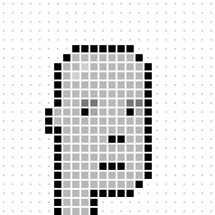

# Punk-opedia  - The Do-It-Yourself (DIY) Punk Universe ("Punkverse") Encyclopedia

Sample Draft Page - Work-In-Progress

## Designs

24x24 - width x height  (max. 576 pixels)

**Human Male**

  

| 5 Colors | 191 Pixel(s)|
|------|------|
| \#1 - BLACK |  (55)  |
|  \#2  |  (4)   |
|  \#3  |  (2)   |  
|  \#4 |  (128)   | 
|  \#5 |  (2)  |  

¹: From darkest (black) to lightest (white)

Variants

Lighter   

<table width="100%">
<tr>
<td markdown="1" style="vertical-align: top;">

</td>
<td markdown="1" style="vertical-align: top;">  
  
1.  (55)   #000000 / rgb(  0   0   0) - hsl(  0°   0%   0%)           - BLACK
2.  (4)  #a58d8d / rgb(165 141 141) - hsl(  0°  12%  60%)
3.  (2)  #c9b2b2 / rgb(201 178 178) - hsl(  0°  18%  74%)
4.  (128)  #ead9d9 / rgb(234 217 217) - hsl(  0°  29%  88%)
5.  (2)   #ffffff / rgb(255 255 255) - hsl(  0°   0% 100%)           - WHITE

</td>
</tr> 
</table>

  
Light   

<table width="100%">
<tr>
<td markdown="1" style="vertical-align: top;">
  

</td>
<td markdown="1" style="vertical-align: top;">  

1.  #000000 / rgb(  0   0   0) - hsl(  0°   0%   0%)           - BLACK
2.  #a66e2c / rgb(166 110  44) - hsl( 32°  58%  41%)
3.  #d29d60 / rgb(210 157  96) - hsl( 32°  56%  60%)
4.  #dbb180 / rgb(219 177 128) - hsl( 32°  56%  68%)
5.  #e7cba9 / rgb(231 203 169) - hsl( 33°  56%  78%)

</td>
</tr>  
</table>
    
Dark    

Darker   
