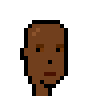
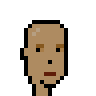
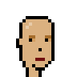
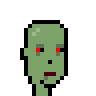
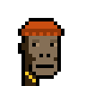
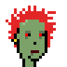

# (Female) Unisize Archetypes

Female Unisize Archetypes with Same Size / Dimensions
and Eye/Nose/Mouse Positions as Male Archetypes

4x

Let's try converting the top selling punks to punkettes
using the new unisize female archetypes.

Punk #7804  
->    

Punk #3100  
->    

Punk #5217  
->    

Punk #7252   
->    

Punk #8857    
->    

## Questions? Comments?

Post them on the [CryptoPunksDev reddit](https://old.reddit.com/r/CryptoPunksDev). Thanks.

